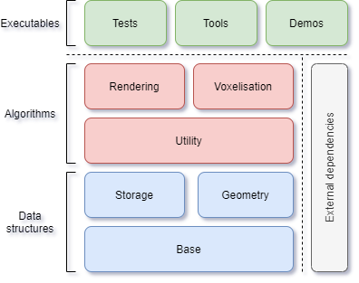

# Cubiquity Voxel Engine

Cubiquity is an experimental [micro-voxel engine](#what-is-a-micro-voxel-engine) written in C++ and released into the [public domain](https://creativecommons.org/publicdomain/zero/1.0/).

	
	<i>A sub-cm voxelisation of Quake's E1M1 (left) can be compressed so efficiently that it fits on a floppy disk. The single-threaded CPU pathtracer produces attractive images (centre) but is not real-time. An experimental renderer based on geometry instancing runs faster but still needs further development (right).</i>

The engine provides a collection of low-level data structures and algorithms which can be useful when implementing higher-level engines, games and other interactive applications. These include a compact and efficient volume representation, tools for voxelisation and content creation, and helper functions for rendering via geometry instancing or raytracing. This software is aimed at developers (not end-users) and requires a decent amount of C++ and graphics programming experience to use effectively.

> :warning: **Warning**: Cubiquity is under development and is not yet ready for use! This is a *personal research project* and I only get a couple of hours a week so progress can be slow. But hopefully there is enough material to show the intended direction of the project.

This version of Cubiquity is the spiritual successor to the [PolyVox](http://www.volumesoffun.com/polyvox-about/) engine and a [previous voxel engine](https://bitbucket.org/volumesoffun/cubiquity/src/master/) also called Cubiquity. See the [history](#history) section for more details.

## Contents
* [Features](#features)
* [Structure](#structure)
* [Usage](#usage)
* [License?](#license)
* [FAQs](#faqs)
* [History](#history)
* [Contributing](#contributing)
* [Credits](#credits)

## Features
The main features of Cubiquity are:

* The engine is **lightweight and easy to integrate** with external game engines and/or graphics libraries. It consists of a small number of **zero-dependency C++ files** which can be directly added to your project or built into a library. Because it is **public domain** there are **no obligations or restrictions** on what you can do with the code.

* Volume data is stored in a **Sparse Voxel DAG** which allows for extremely efficient compression and hence very large environments. The implementation builds on the [original SVDAG paper](http://www.cse.chalmers.se/~uffe/HighResolutionSparseVoxelDAGs.pdf) and also includes some concepts described in the ['HashDAG' paper](https://graphics.tudelft.nl/Publications-new/2020/CBE20/ModifyingCompressedVoxels-main.pdf), along with some novel contributions of its own. Taken together, these enable **runtime modifications** to the volume as well as support for **per-voxel material identifiers**.

* A robust voxelisation algorithm based on [3D rasterisation](http://web.eecs.utk.edu/~huangj/papers/polygon.pdf) and [generalised winding numbers](https://igl.ethz.ch/projects/winding-number/robust-inside-outside-segmentation-using-generalized-winding-numbers-siggraph-2013-jacobson-et-al.pdf). This allows for **true 'solid' (filled) voxelisation** while also supporting multiple materials in the source mesh. The implementation uses a spatial hierarchy to improve performance and **includes an SIMD (AVX) version** of the winding number evaluation.

* An experimental rendering algorithm based on **geometry instancing**, driven by **a software occlusion-culling system**. This is in contrast to the more commonly used mesh extraction or raycasting process.

* An implementation of [fast ray vs volume intersections](http://wscg.zcu.cz/wscg2000/Papers_2000/X31.pdf), demonstrated by a (non-real-time) pathtracer and also available for other uses such as collision detection. 

## Structure
The engine consists of a number of modules, each [implemented in a single C++ header and corresponding source file](src/cubiquity). There are no external dependencies (beyond the C++ standard library) and each module requires only those below it in the diagram. This makes it easy to drop the source files into your project, or alternatively you can build them into a static library.

The tests, tools and demos do have a small number of external dependencies, most of which are public domain and bundled in this repository. The only exception is SDL which is typically available through you Linux distribution's package manager or from their website.

## Usage
> :warning: **Warning**: You cannot actually do much with Cubiquity in its current state! But the instructions below should at least get you an image on the screen.

### Prerequisites
Cubiquity uses CMake as its build system and SDL for window/input management in the demos. If you are running Linux these should be easily available from your package manager, but Windows users may need to put in a bit more work (not yet documented here).

This Git repository does not include the sample data you will need to run the demos. You can download it by running the following commands from the root of the repository:

    cd data/
    ./get_data.py
    cd ..

### Building

If you just want to use the Cubiquity library from your software then you can simply add the small number of source files to you project or makefile.

The instructions below are only needed if you want to build a library and/or run the demos, tool, or tests.

#### Linux
Once you have the prerequisites above you can build Cubiquity by running the following commands from the root of the repository:

    mkdir build
    cd build/
    cmake .. -DCMAKE_BUILD_TYPE=Release ..
    make

#### Windows
At a high level the same principle applies as for Linux - you run CMake and the build the resulting project. However, on Windows you would typically use the CMake GUI and Visual Studio, making the process a little more complex to document and so I have not done so for now. Experienced Windows/CMake users can hopefully figure it out, but I will expand these instructions once Cubiquity is more developed.

### Running

All commands should be run from the build folder created above.

#### Demos

Cubiquity comes with two demos to show rendering experiments. These need a lot of work! Currently one is slow and the other is ugly :-) Until now the focus has been more on the internal data structures but I hope to work further on rendering in the future.

##### Controls
* **Right mouse button:** Hold to rotate camera
* **Left mouse button:** Carve sphere from scene
* **W,A,S,D on keyboard:** Move camera.

Both demos search the 'data' folder described under ['Prerequisites'](#prerequisites) above, so do make sure you have followed those instructions.

##### Instancing demo
The instancing demo uses software occlusion culling to determine the set of voxels which are visible from the current camera position, and then renders them as instanced cubes. Currently it redoes the visibility calculation every frame (with obvious performance impact) but there are plans to cache the intermediate visibility results. It has low memory usage compared to the popular 'greedy meshing' approach because it only uploads what is currently on the screen. You can run it as follows:

    ./cubiquity view ../data/shapes.vol --mode=instancing

Which should give the image below (you may need to back the camera off slightly):

##### Pathtracing demo
This demo serves as a benchmark for ray vs. volume intersections and also provides a way to generate nice screenshots (as the instanced renderer is not very attractive). It is slow because it runs on a single CPU thread, but the resolution is automatically reduced when moving the camera so it remains interactive. A GPU implementation would be *significantly* faster and I hope to work on that in the future. You can run it with the following command:

    ./cubiquity view ../data/building.vol --mode=pathtracing

Which should give the image below:

#### Voxelisation
Cubiquity includes a mesh voxeliser to convert Wavefront .obj files into Cubiquity volumes. It uses [generalised winding numbers](https://igl.ethz.ch/projects/winding-number/robust-inside-outside-segmentation-using-generalized-winding-numbers-siggraph-2013-jacobson-et-al.pdf) to perform an inside vs. outside test on octree nodes, and this allows it to correctly fill the interior of objects rather than just drawing a 'shell' into the volume. The approach is very slow - I am aware that there are *much* faster approaches based on e.g GPU rasterisation but the current method is much more robust against cracks, t-junctions, open/missing faces, and other imperfections in the geometry (as well as being conceptually simple).

The various settings (file names, resolution, etc) are not yet exposed via command line parameters, so this tool is not actually usable at the moment (unless you are prepared to edit the source code yourself).

#### Tests
These are various tests for my own internal use. There should be no need for you to run them.

## License?
Cubiquity is released into the public domain via the [CC0 dedication](https://creativecommons.org/publicdomain/zero/1.0/). The source code is not under copyright and so you do not require a licence to use it. There are no restrictions on what you can do with the source code, and no requirements or obligations on your part - **it is completely free for any purpose**.

It would be appreciated if you could credit David Williams and/or the Cubiquity Voxel Engine, but you are not required to do so.

For full details please see [COPYING.txt](COPYING.txt)

## FAQs
### What is a (micro) voxel engine?
Most 3d applications represent a scene by using triangles to define the surface of objects. The inside of objects is not explicitly stored, making it difficult to modify them at runtime. A *voxel* (short for *vo*lume *el*ement) representation instead samples the scene on a 3D grid and stores relevant attributes for each sample position.

Cubiquity uses the 'micro' prefix to differentiate itself from popular voxel engines such as that used by Minecraft, which use a very course sampling e.g. each voxel being one metre across. Voxels in Cubiquity are instead expected to be just a few mm/cm for a typical scene (though technically they are unitless).

### Does Cubiquity support procedural generation?
Cubiquity provides a simple 'setVoxel(...)' interface to its volume data, which means that technically you can inject data from whatever source you choose (including the output of procedural methods). However, you will find it is prohibitively slow to set large amounts of data in this way. Instead you should generate your volumes offline as a separate process, save the result to disk, and then load it into your application when required.

While you may get away with generating a limited amount of data at application start-up, you should definitely avoid *on-the-fly* generation, i.e. updating your volume data in response to the camera moving around. Instead all data should be in the volume before you start using it.

### Does Cubiquity provide a C API?
No, there is no C API at present. I would be interested in adding one in the future, and/or refactoring the current API to make it more C-like. If you need a C API to access Cubiquity functionality from other languages or environments then you will need to provide your own C wrappers around the parts that you want to use.

### Does Cubiquity provide integration with other engines?
There is currently no integration with other engines and no clear plan here. For now I am happy working on the core library and engaging in research. If engine integrations are added in the future then I will probably investigate Godot first (as it is open source), then Unreal, and then Unity (where accessing native code is more difficult).

I may also look at using a higher level graphics framework for a more complete demo, but this is also a little way off.

### What is the link between this project and the one on Bitbucket?
The [Bitbucket project](https://bitbucket.org/volumesoffun/cubiquity) is an old project which wrapped the PolyVox library with some higher-level functionality to allow easier integration into Unity and Unreal. It is no longer active. This current project adopts the name but is completely new code. See the [History](#history) section for more details.

## History
I discovered voxels when doing my PhD in medical visualization back in 2005. It was immediately clear to me that the technology was interesting for games as it allowed more interactive and destructible environments. My first 'engine' was basically a tech demo that allowed the environment to be edited while objects bounced around the scene ([the video is still available on YouTube](https://www.youtube.com/watch?v=5XTJABlV9zw)).

I then factored out the core functionality into the [PolyVox library](http://www.volumesoffun.com/polyvox-about/) which was used by [several games and demos](http://www.volumesoffun.com/polyvox-projects/) (partly thanks to the launch of Minecraft putting the spotlight on voxels for gaming). [My brother](https://github.com/milliams) also contributed, and between us we launched 'Volumes of Fun' and created our first game ['Voxeliens'](https://www.youtube.com/watch?v=QiA0OxKeKto).

The game was not a huge success (hardly surprising given the competitiveness of the indie gaming landscape) so we instead turned our attention to making the technology available to a wider audience. This led to the development of the [original Cubiquity engine](https://bitbucket.org/volumesoffun/cubiquity) (which basically wrapped PolyVox with some higher-level functionality) and its integration with both [Unity](https://bitbucket.org/volumesoffun/cubiquity-for-unity3d) (done my myself) and [Unreal](https://github.com/volumesoffun/cubiquity-for-unreal-engine) (done by Matt).

The Unity version was sold as a commercial package on the asset store for a while and enjoyed some success, but it was a lot of work and I suffered from dwindling free time to work on it. Furthermore, voxel engines were *everywhere* by this point and had a lot of similarities (marching cubes or greedy meshing, chunk based terrain, etc). I wanted to break away from the commercial angle and focus on something more experimental and research-oriented.

Which brings us to this current version of Cubiquity. Although I have kept the name, it is a complete rewrite compared to the previous version. It is more experimental and has no commercial ambitions. In time I may well integrate with an external game engine but this is still some way off.

## Contributing
Cubiquity is a personal project and unfortunately I'm not looking for external contributions. Please do not send feature requests or pull requests (I actually have a separate repository for development and just copy changes across to this one, so they won't merge cleanly anyway). I'll probably address build problems and bug reports though.

## Credits
Cubiquity makes use of a few external projects, all of which are in the public domain. Note that they are not dependencies because they have been integrated into the Cubiquity code base.

* **linalg.h:** https://github.com/sgorsten/linalg
* **MurmurHash3:** https://github.com/aappleby/smhasher/wiki/MurmurHash3
	
The demos, tools, and tests also use some external projects, most of which can be found in the src/external folder (except SDL). 

* **Flags library:** https://github.com/sailormoon/flags
* **Glad OpenGL loader:** https://glad.dav1d.de/
* **LearnOpenGL tutorials:** https://learnopengl.com/
	Note: This project switched its license from Public Domain to CC BY-NC 4.0 in 2018 (see https://github.com/JoeyDeVries/LearnOpenGL/commits/master/LICENSE.md). The Cubiquity examples are derived from the original Public Domain version.
* **Simplex Noise functions:** https://github.com/stegu/perlin-noise
* **STB libraries:** https://github.com/nothings/stb
* **SDL library:** https://www.libsdl.org/
	Note: SDL is not public domain but is also not actually included in this repository. Instead the system-provided version is used when compiling the demos.
